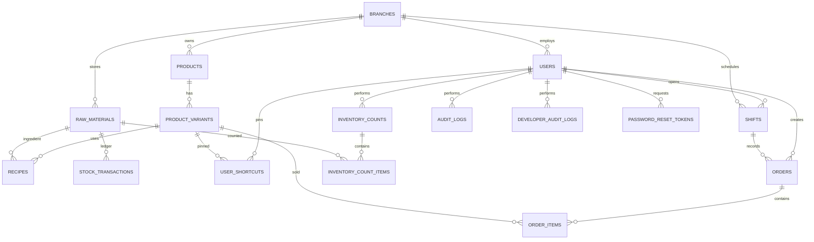

# Database

The system uses SQLite in WAL mode. The database file is `data/coffeeshop.db`; backups and the application secret are kept under `data/`. In containers, mount `/app/data` as a persistent volume. Schema creation and safe migrations run through `init_db()` (`python run.py --init-db`).

## Entity relationships

## Tables

- `schema_migrations`: migration versions and timestamps.
- `branches`: branch identity and address.
- `users`: role, credentials, profile, and employment state.
- `user_shortcuts`: per-user pinned product variants.
- `products`, `product_variants`: menu catalogue and prices.
- `raw_materials`: stock truth, units, costs, and alert thresholds.
- `recipes`: variant ingredients, quantities, and waste factors.
- `stock_transactions`: append-only stock movement ledger.
- `shifts`: opening/closing cash and operator shifts.
- `orders`, `order_items`: orders, payment/discount totals, and sold variants.
- `inventory_counts`, `inventory_count_items`: physical inventory sessions and adjustments.
- `audit_logs`, `developer_audit_logs`: business and privileged activity trails.
- `system_settings`: encrypted/configurable system values.
- `ml_models`: persisted ML weights and metadata (excluded from retention cleanup).
- `sync_queue`, `sync_conflicts`: offline-first remote synchronization state.
- `password_reset_tokens`: short-lived, single-use reset tokens.
- `alerts`: generated stock and operational alerts.

Foreign keys are enabled for every connection. Orders are cancelled rather than deleted so stock reversals and audit history remain traceable. Back up the whole `data/` directory, not only the SQLite main file, because WAL may contain committed data.
